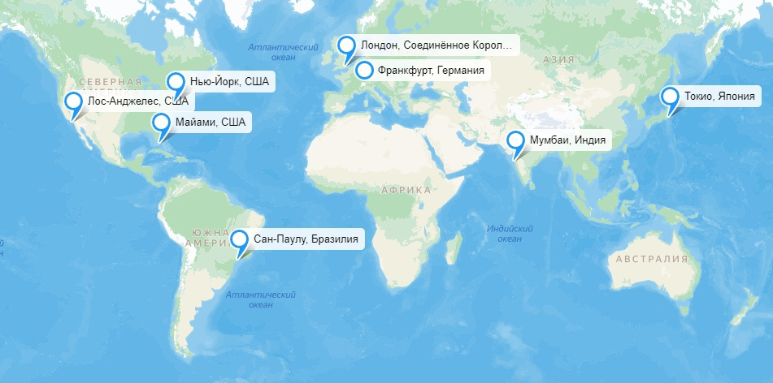
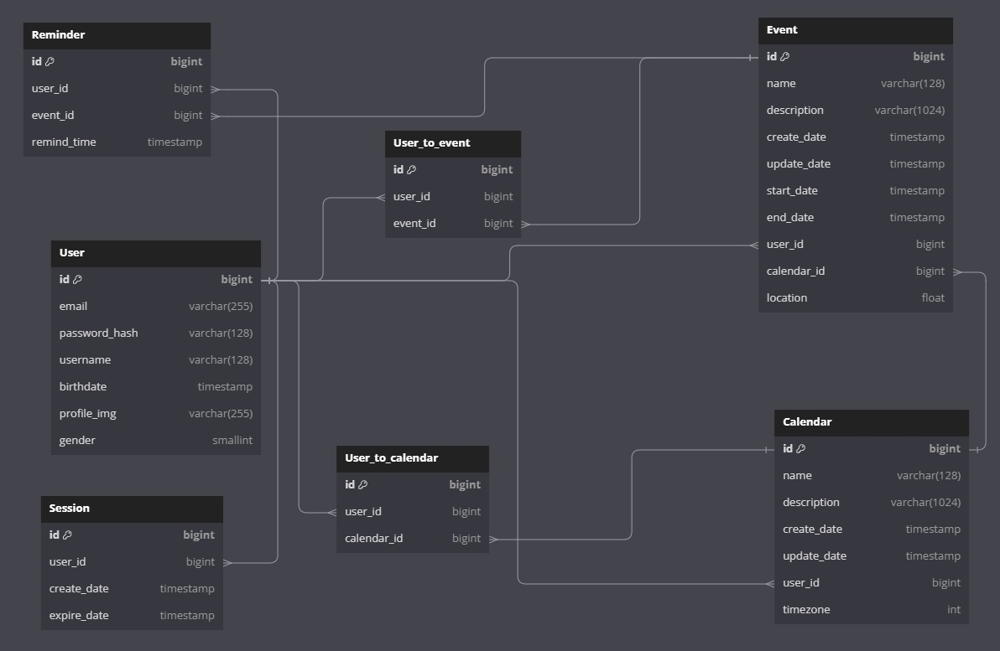
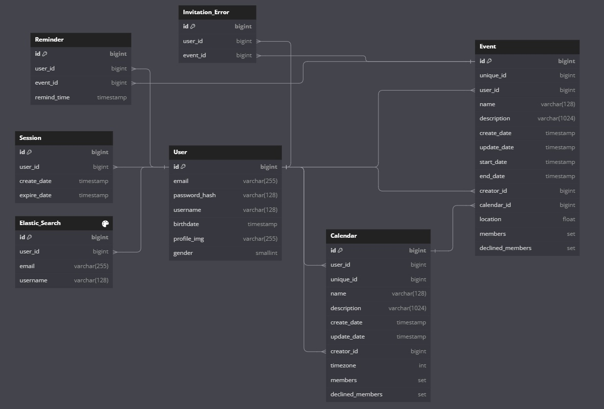

# Программирование высоконагруженного сервиса напоминаний и планирования событий

## Оглавление

- [1 Тема и целевая аудитория](#1-Тема-и-целевая-аудитория)
- [2 Расчёт нагрузки](#2-Расчёт-нагрузки)
- [3 Глобальная балансировка нагрузки](#3-Глобальная-балансировка-нагрузки)
- [4 Локальная балансировка нагрузки](#4-Локальная-балансировка-нагрузки)
- [5 Логическая схема БД](#5-Логическая-схема-БД)
- [6 Физическая схема БД](#6-Физическая-схема-БД)
- [7 Алгоритмы](#7-Алгоритмы)
- [8 Технологии](#8-Технологии)

# 1 Тема и целевая аудитория

## Тема

Google Calendar - сервис для планирования мероприятий, задач и встреч, позволяющий указывать подробную информацию и устанавливать напоминания, предоставляющий совместный доступ к планированию.

## MVP

1. Авторизация с помощью Google
2. Отображение календаря
3. Добавление новых мероприятий/задач
4. Редактирование информации о мероприятии (время, место и т. д.)
5. Установка напоминаний о событии
6. Прикрепление других пользователей к событию
7. Совместное отображение и редактирование календарей
8. Поиск по событиям

## ЦА

Размер целевой аудитории: около 500 млн. пользователей в месяц. [[1]](https://earthweb.com/blog/google-calendar-users/) [[3]](https://zipdo.co/google-calendar-statistics/)

Ниже приведена статистика по возрасту целевой аудитории, начиная с 18 лет [[2]](https://pro.similarweb.com/#/digitalsuite/websiteanalysis/audience-demographics/*/999/1m?webSource=Total&key=calendar.google.com)
Возрастная группа | Процентное соотношение
------------ | -------------
18-24 года| 14,05% 
25-34 года| 29,47% 
35-44 года| 20,31%
45-54 года| 16,77%
55-64 года| 11,92%
65+| 7,48%

Гендерное распределение аудитории Google Calendar [[2]](https://pro.similarweb.com/#/digitalsuite/websiteanalysis/audience-demographics/*/999/1m?webSource=Total&key=calendar.google.com):
Пол          | Процентное соотношение
-------------| -------------
Мужской      | 50,26%
Женский      | 49,74% 

Общемировая география пользователей Google Calendar [[2]](https://pro.similarweb.com/#/digitalsuite/websiteanalysis/audience-geography/*/999/1m?key=calendar.google.com&webSource=Total):  
Регион           | Процентное соотношение
---------------- | -------------
США                     | 34,42%
Япония                  | 19,83% 
Бразилия                | 4,12% 
Объединённое королевство| 2,95% 
Канада                  | 2,9% 
Остальные               | 35,76%

# 2 Расчёт нагрузки

## Продуктовые метрики

Информация о DAU сервиса отсутствует в открытых источниках, поэтому примем, что DAU/MAU = 25%, так как сервис используется для планирования дневных задач и мероприятий, что предполагает частое использование. В таком случае DAU = 1/4MAU = 125 млн. пользователей.

Метрика      | Значение
-------------| -------------
Месячная аудитория MAU        | 500 млн. пользователей
Дневная аудитория DAU         | 125 млн. пользователей
Средняя длительность сессии   | 07:23 минут [[4]](https://webstatsdomain.org/d/calendar.google.com)

### Хранилище данных для пользователя

Сначала посчитаем вес одного события в календаре. Поскольку символы в UTF-8 могут кодироваться разным количеством байтов(от 1 до 4), а Google Calendar имеет многоязычную аудиторию, то можно взять средний размер символа равный 3 байтам.

Параметр          | Вес
-------------| -------------
Название                                   | 128 символов UTF-8
Описание                                   | 1024 символа UTF-8
Дата создания                              | 8 Б
Дата последнего обновления                 | 8 Б
Дата начала события                        | 8 Б
Дата окончания события                     | 8 Б
Ссылка на создателя                        | 8 Б
Email гостя                                | 255 Б
Максимальное количество гостей             | 20
Местоположение                             | 8 Б
Календарь                                  | 8 Б
Общий размер                               | 128 * 3 + 1024 * 3 + 8 + 8 + 8 + 8 + 8 + 255 * 20 + 8 + 8 = 8604 Б

В среднем каждый день средний пользователь среднего календаря создает 5 событий [[7]](https://reclaim.ai/blog/productivity-report-one-on-one-meetings).

По версии сайта marketsplash.com в среднем в день создаётся около 1.5 млрд событий. [[8]](https://web.archive.org/web/20240424130647/https://marketsplash.com/google-workspace-statistics/). Тогда, поделив это число на DAU, получим 1.5 млрд/125 млн = 12 событий.

События хранятся в памяти 1 год после завершения [[9]](https://www.calendar.com/blog/how-do-you-look-up-past-appointments-in-your-calendar/), поэтому на одного пользователя в среднем нужно: 

365 * 12 * 8604 Б = 35,94 Мб

Также есть лимит в 10000 событий, после которого старые события удаляются [[6]](https://classroom.synonym.com/google-calendar-limits-17378.html).

Посчитаем вес одного календаря.

Параметр          | Вес
-------------| -------------
Название                                   | 128 символов UTF-8
Описание                                   | 1024 символа UTF-8
Дата создания                              | 8 Б
Дата последнего обновления                 | 8 Б
Ссылка на создателя                        | 8 Б
Часовой пояс                               | 8 Б
Общий размер                               | 8 + 8 + 8 + 8 + 128 * 3 + 1024 * 3 = 3488 Б

На календари у пользователей также есть лимит в 25 штук [[6]](https://classroom.synonym.com/google-calendar-limits-17378.html).

25 * 3488 Б = 85,156 Кб

Посчитаем средний размер хранилища пользователя.

Параметр          | Вес
-------------| -------------
Добавление событий                         | 20 запросов/день
Получение напоминаний                      | 40 запросов/день
Размер событий                             | 35,94 Мб
Размер календарей                          | 85,156 Кб
Информация о пользователе                  | 1 Кб
Общий размер                               | 82,054 Мб + 85,156 Кб + 1 Кб = 82,138 Мб

## Технические метрики

### Размер хранения в разбивке по типам данных

Поскольку было найдено примерное количество пользователей, а MAU = 500 млн, то можно рассчитать примерный размер хранения по этим типам данных:

По событиям: 35,94 Мб * 500 млн = 17 137,3904 Тб = 16,73 Пб

По календарям: 25 * 3488 Б * 500 млн = 39,65 Тб

### Динамический рост

Сейчас Gmail имеет базу поьзователей в 4.3 млрд (на момент 18 апреля 2024). Прогнозируют рост этого показателя до 4.6 млрд к 2025 [[11]](https://www.broadbandsearch.net/blog/google-statistics-facts). Поскольку Gmail непосредственно связан с Google Calendar, можно предположить, что рост его базы пользователей будет пропорциональным. Таким образом, можем посчитать на сколько процентов повышается база пользователей Gmail и применить этот показатель к MAU Google Calendar.

500 * ((4 600 000 000 / 4 300 000 000 - 1) / 8) = 4,36 млн

Получаем, что каждый месяц число пользователей увеличивается на 4,36 млн. Теперь можем посчитать ежемесячный прирост хранилища данных:

4,36 млн * 82,138 Мб = 341,5 Тб

### Сетевой трафик

Следует учесть, что при добавлении гостя к событию, гостю приходит приглашение, а также то, что гость должен ответить на приглашение. Возьмём, что в среднем к событию прикрепляется один гость.

1. Просмотр календаря:

* 25 запросов/день. 25 * 3488 Б = 85,16 Кб

2. Добавление событий:

* 12 запросов/день. 12 * 8604 Б = 100,8 Кб

3. Получение напоминаний. Поскольку на одно событие приходится одно напомининие:

* 12 запросов/день. Оценим напоминание в 1 Кб. 12 * 1Кб = 12 Кб.

4. Получение приглашений. Поскольку на одно событие приходится одно приглашение:

* 12 запросов/день. Оценим приглашение в 1 Кб. 12 * 1Кб = 12 Кб.

5. Получение ответов на приглашение. Поскольку на одно событие приходится одно приглашение:

* 12 запросов/день. Оценим ответ на приглашение в 1 Кб. 12 * 1Кб = 12 Кб.

### Сетевой трафик по видам активности в виде таблицы

Пиковое значение пользователей можно оценить примерно в 2 раза. Возьмём запас в 2.5.

DAU = 125 млн.

Тип                           | Отправка  | Отправка Гб/сек | Пиковое значение Гб/сек |
-------------                 | ------------------------------------  |--------------- |----------------- |
Просмотр календаря            | 125 млн * 85,16 Кб = 10 151,8 Гб      | 0.117          | 0.294            |
Добавление событий            | 125 млн * 100,8 Кб = 12 016,3 Гб      | 0.139          | 0.348            | 
Получение напоминаний         | 125 млн * 12 Кб = 1430,5 Гб           | 0.017          | 0.041            | 
Получение приглашений         | 125 млн * 12 Кб = 1430,5 Гб           | 0.017          | 0.041            |
Получение ответов на приглашения         | 125 млн * 12 Кб = 1430,5 Гб           | 0.017          | 0.041            |
Итого                         | 26 460 Гб	                            | 0.306          | 0.766            |

### RPS

Тип                                 | RPS  | Пиковое значение |
------------------------------------| ---  |----------------- |
Просмотр календаря                  | 125 млн * 25 / 86400 сек = 36 169   | 90 423            |
Добавление событий                  | 125 млн * 12 / 86400 сек = 17 361   | 43 403            |
Получение напоминаний               | 125 млн * 12 / 86400 сек = 17 361   | 43 403            |
Получение приглашений               | 125 млн * 12 / 86400 сек = 17 361   | 43 403            |
Получение ответов на приглашения    | 125 млн * 12 / 86400 сек = 17 361   | 43 403            |
Итого                               | 125 млн * 73 / 86400 сек = 105 613  | 264 034           |

# 3 Глобальная балансировка нагрузки

По версии сайта hypestat.com распределение пользователей по местонахождению имеет следующий характер [[10]](https://hypestat.com/info/calendar.google.com):

Регион           | Процентное соотношение
---------------- | -------------
США                     | 18,8%
Индия                   | 10,7% 
Япония                  | 5,2% 
Россия                  | 2,9% 
Бразилия                | 2,8% 

Исходя из этих данных, а также из данных, представленных в 1 пункте, можно сделать вывод, что наибольшее количество пользователей находится в США. Также крупными регионами являются Индия, Япония, Бразилия и Европа.

Из этого можно сделать вывод, что следующее расположение ДЦ будет наиболее предпочтительным:

* Лос-Анджелес, США

* Нью-Йорк, США

* Майами, США

* Сан-Паулу, Бразилия

* Франкфурт, Германия

* Мумбаи, Индия

* Токио, Япония

Полную карту можно посмотреть здесь (https://yandex.ru/maps/?um=constructor%3Ae21060ef020adb7da3aa4cf59ba341c5599006ff95ce84aca2b34eb51499d540&source=constructorLink)

## RPS по регионам

Тип запроса                  |	RPS (Лос-Анджелес) |	RPS (Нью-Йорк) |	RPS (Майами) |	RPS (Сан-Паулу)	| RPS (Франкфурт) |	RPS (Мумбаи) |	RPS (Токио)
-----------------------------| -------------------| -------------------| --------------------| ---------------| ----------------| -------------| -------------
Просмотр календаря           |	12659.22             |	12659.22             |	7233.84              |	9042.3          |	21701.52          |	13563.45      |	13563.45
Добавление событий           |	6076.42            |	6076.42             |	3472.24	             | 4340.3          |	10416.72	          | 6510.45      |	6510.45
Получение напоминаний        |	6076.42            |	6076.42             |	3472.24	             | 4340.3          |	10416.72	          | 6510.45      |	6510.45
Получение приглашений        |	6076.42            |	6076.42             |	3472.24	             | 4340.3          |	10416.72	          | 6510.45      |	6510.45
Получение ответов на приглашения            |	6076.42            |	6076.42             |	3472.24	             | 4340.3          |	10416.72	          | 6510.45      |	6510.45
Итого                        |	36964.76           |	36964.76           |	21122.72             |	26403.4         |	63368.16          |	39605.1      |	39605.1

## DNS-балансировка

В данном случае эффективно использовать Geo-based DNS, так как у нас есть ряд ярко выраженных регионов, которые расположены далеко друг от друга и в каждом из которых есть ДЦ.

## BGP Anycast

Если рассматривать регион США, то видно, что в нём находится 3 ДЦ, а также большинство пользователей сервиса. Исходя из этого, применим технологию BGP Anycast, которая в рамках США будет справляться с выбором необходимого ДЦ для конкретного пользователя и учитывать задержку.

# 4 Локальная балансировка нагрузки

Для балансировки был выбран L7 балансировщик, так как он обеспечивает равномерное распределение нагрузки и поможет решить проблему медленных клиентов.

Будем использовать балансировщик NGINX, так как он обладает высокой производительностью, гибко настраивается и поддерживает большое количество протоколов. В качестве стратегии балансировки можно выбрать round robin. Для кэширования SSL в целях оптимизации выберем Session Cache.

Для оркестрации сервисов будем использовать Kubernetes по следующим причинам:

* Масштабирование через auto-scaling, позволяющее эффективно использовать ресурсы

* Распределение и перераспределение экземпляров по узлам

Для обеспечения отказоустойчивости будем применять протокол VRRP(Virtual Router Redundancy Protocol), который позволит нам при отказе одного из балансировщиков перенести весь трафик на другую машину, поднятую на том же IP адресе. Так же можно использовать keepalive соединение, которое позволит отслеживать и оповещать балансировщик о доступности узлов.

# 5 Логическая схема БД

Полную схему можно посмотреть здесь (https://dbdiagram.io/d/Copy-of-Stage_5-670cc75897a66db9a3de522e)

## Размеры данных в таблице

| User                 | Calendar             | Event                 | Session          | User_to_calendar  | User_to_event  | Reminder       |
| -------------------- | -------------------- | --------------------- | ---------------- | ----------------- | -------------- | -------------- |
| id (8 B)             | id (8 B)             | id (8 B)              | id (8 B)         | id (8 B)          | id (8 B)       | id (8 B)       |
| email (255 B)        | name (128 B)         | calendar_id (8 B)     | user_id (8 B)    | user_id (8 B)     | user_id (8 B)  | user_id (8 B)  |
| password_hash (128 B)        | user_id (8 B)       | user_id (8 B)         | create_date (8 B) | calendar_id (8 B) | event_id (8 B) | event_id (8 b)  |
| username (128 B)     | timezone (72 B)      | create_date (8 B)     | expire_date (8 B) |                  |                | remind_time (8 B)
|                      | description (1024 B) | update_date (8 B)     |                  |                   |                |
|                      |                      | start_date (8 B)      |                  |                   |                |
|                      |                      | end_date (8 B)        |                  |                   |                |
|                      |                      | name (128 B)          |                  |                   |                |
|                      |                      | description (1024 B)  |                  |                   |                |
|                      |                      | location (4 B)        |                  |                   |                |

Итого:

|                    | User                 | Calendar             | Event                 | Session          | User_to_calendar  | User_to_event  | Reminder     |
| ------------------ | -------------------- | -------------------- | --------------------- | ---------------- | ----------------- | -------------- | ------------ |
| Вес записи         | 517 B                | 1240 B               | 1212 B                | 32 B             | 24 B              | 24 B           | 32 B         |
| Количество записей | 500 млн (MAU)        | 25 * 500 млн         | 365 * 12 * 500 млн    | 125 млн (DAU)    | 25 * 500 млн * 10 | 365 * 12 * 500 млн * 2 | 365 * 12 * 500 млн         |
| Общий размер       | 240 Gb               | 14 435 Gb            | 2 414 Tb              | 3,72 Gb          | 2 793 Gb          | 97 900 Gb      | 65 267 Gb    |

Запросов на чтение в БД поступает значительно больше, чем запросов на запись во всех таблицах.

# 6 Физическая схема БД

## Индексы

В качестве индексов выбраны:

* Для таблицы Calendar индекс на user_id, для быстрой выдачи календарей пользователя. Также необходим индекс на unique_id для быстрого изменения и удаления всех копий одного календаря.

* Для таблицы Event индекс на user_id, для быстрого отображения событий пользователя, индекс на start_date для отображения событий в нужном временном диапозоне, а также индекс на name для быстрого поиска событий. Также необходим индекс на unique_id для быстрого изменения и удаления всех копий одного календаря.

* Для таблицы Reminder индекс на remind_date, так как необходимо быстро отображать напоминания при достижении временной отметки и индекс на user_id для отображения напоминаний пользователя.

* Для таблицы Elastic_Search индекс на email и username, для быстрого поиска пользователей.

## Денормализация

Чтобы избавиться от таблиц User_to_calendar и User_to_event, так как они будут требовать JOIN запросов, что крайне не эффективно, добавим в таблицы Event и Calendar поля-массивы members и declined_members, которые будут содержать id всех участников и id отказавшихся участников события и календаря соответсвенно.

Чтобы не допустить критической нагрузки на БД, при приглашении людей в событие или календарь, для каждого присоединившегося пользователя будет создавать копию изначального события в таблице Events. Так как в каждом событии может быть максимум 20 пользователей, созданный этим изменением дополнительный размер БД будет приемлимым. Необходимо учесть, что при изменении события, его элементы должны также меняться во всех копиях этого события. Для реализации такого подхода добавим в таблицу Event поле Unique_id, которое будет одинаковым для всех копий одного события. С помощью данного поля можно будет быстро находить и применять изменения ко всем копиям одного события. 

Для таблицы календарей применим аналогичное решение.

Так же для эффективного поиска пользователей для приглашения в событие былоо решено добавить таблицу Elastic_Search, которая будет отвечать за эффективный поиск по пользователям с помощью СУБД Elasticsearch.

Также добавим таблицу Invitation_Error. Её цель и особенности подробно разобраны в [главе 7](#7-Алгоритмы).

Полную схему можно посмотреть здесь (https://dbdiagram.io/d/new-Satge-6-67165a5b97a66db9a3b9f08f)

## Выбор СУБД

Для таблиц User, Reminder, Calendar и Event рационально использовать Cassandra, так как мы имеем большие нагрузки на чтение и запись, для чего подходит данная СУБД.

Для хранения сессий и ошибок рационально использовать in-memory СУБД, например Tarantool, так как эти таблицы имеют небольшой размер и требуют быстрого доступа к данным.

Таблица Ealstic_Search нужна для полнотекстового поиска по пользователем для приглашения в событие, соответсвенно используем Elasticsearch.

| User                 | Calendar             | Event                 | Session          | Invitation_error | Reminder       | Elastic_Search |
| -------------------- | -------------------- | --------------------- | ---------------- | ---------------- | -------------- | -------------- |
| Cassandra            | Cassandra            | Cassandra             | Tarantool        | Tarantool        | Cassandra      | Elasticsearch  |

## Шардирование

| User                 | Calendar             | Event                 | Reminder       | Elastic_Search |
| -------------------- | -------------------- | --------------------- | -------------- | -------------- |
| id                   | unique_id            | unique_id             | user_id        | username       |

Таблицу User шардировать рационально по полю id, чтобы обеспечить псевдослучайное распределение по шардам, и, как следствие, равномерную нагрзку на все шарды.

Таблицу Reminder шардировать рационально по полю user_id, чтобы во-первых обеспечить псевдослучайное распределение, а во-вторых обеспечить использование минимума шардов для запросов получения напоминаний одного пользователя.

Таблицы Event и Calendar шардировать рационально по unique_id, чтобы задействовать минимум шардов для изменения всех копий одного события или календаря.

В случае Elastic_Search официальная документация рекомендует ограничивать размер шарда 50 GB [[11]](https://www.elastic.co/guide/en/elasticsearch/reference/current/size-your-shards.html). Шардировать будем по самому частому параметру поиска, так как это позволит эффективно использовать минимум шардов для поиска совпадений. В нашем случае этим параметром будет поле username.

Сессию и ошибки шардировать не будем, так как они не имеет большого размера и в этом нет необходимости.

## Реплецирование

| User                 | Calendar             | Event                 | Reminder       | Session          | Invitation_error |
| -------------------- | -------------------- | --------------------- | -------------- | ---------------- | ---------------- |
| master-slave         | master-slave         | master-slave          | master-slave   | master-slave     | master-slave     |

Для репликации во всех таблицах Cassandra разумно использовать схему с одним master для записи и многими slave для чтения, так как в нашем приложении основная нагрузка приходится именно на чтение. Это также позволит обеспечить отказоустойчивость. Рационально использовать 2-3 slave.

В таблицах Session и Invitation_error также будем использовать master-slave репликацию для обеспечения отказоустойчивости.

## Клиентские библиотеки

Для языка Go, на котором будет написан backend, можно использовать следующие библиотеки:

Cassandra: gocql

Tarantool: go-tarantool

Elasticsearch: go-elasticsearch

## Резервное копирование

Будем проводить полное резервное коипрование каждые 2 недели, а так же дифференциальное резервное коипрование каждые два дня.

# 7 Алгоритмы

## Реализация отправки приглашений в событие и получение ответов на них 

Для реализации отправки приглашений в событие необходимо обеспечить отправку этих приглашений при создании события. Из предыдущих разделов видно, что события создаются регулярно в больших количествах, а приглашений на каждое событие может быть несколько, что кратно увеличивает их количество. Поэтому для эффективной рассылки приглашений предлагается использовать Kafka, так как он является эффективным брокером сообщений и идеально подходит для данной задачи.

Будет разработан отдельный микровсервис для отправки приглашений пользователям. Из основного микросервиса в микросервис для отправки приглашения будут передаваться напрямую через Kafka. Далее приглашение приходит пользователю, он дает ответ наприглашение, и этот ответ поступает обратно в микросервис для отправки. Из него опять через Kafka ответ поступает в основной микросервис и происходит запись в БД. В зависимости от ответа пользователя он записывается либо в участников события, либо в отказавшихся участников.

Приглашения должны быть доставлены до пользователя, однако может возникнуть проблема, при которой ошибки отправки будут вызывать потерю данных, так как сами приглашения не хранятся в БД. Для решения этой проблемы можно создать в БД таблицу ошибок отправки, в которую будут помещаться запросы, недошедшие до пользователя, а также запросы, на которые не пришел ответ от пользователя. Эти запросы затем необходимо загружать обратно в очередь Kafka. Таким образом мы можем разгрузить саму очередь в Kafka, которая вместо повторной отправки неудачного запроса (в рамках одного partition), будет отправлять сразу следующий запрос, а также это позволит избежать потери данных без излишней нагрузки на БД.

# 8 Технологии

| Технология     | Область применения                       | Обоснование                                                                                                       |
| -------------- | ---------------------------------------- | ----------------------------------------------------------------------------------------------------------------- |
| Typescript     | Фронтенд                                 | Статически типизируемый язык программирования, который преобразуется в JavaScript, но при этом за счёт статической типизации позволяет избежать ошибок на этапе написания кода. |
| React          | Фронтенд                                 | Библиотека для построения пользовательских интерфейсов. Подходит для SPA, поддерживает эффективный рендеринг благодаря Virtual DOM, а также имеет огромную поддержку и хорошую масштабируемость. |
| Golang         | Бэкенд                                   | Язык программирования для серверной части приложения. Имеет очень эффективную модель многопоточности, которая рациональна для использования в высоконагруженных сервисах. |
| Nginx          | Балансировщик нагрузки уровня L7         | Высокопроизводительный веб-сервер и обратный прокси-сервер, часто используется как балансировщик нагрузки. Обладает высокой скоростью, гибкостью конфигурации и хорошей поддержкой. |
| Docker         | Среда выполнения контейнеров             | Инструмент для контейнеризации приложений. Основными преимуществами такого подхода являются изолированность приложений и их независимость от среды и окружения. |
| Kubernetes     | Оркестрация и развертывание контейнеров  | Система оркестрации контейнеризированных приложений. Позволяет управлять кластером контейнеров, а также помагает в балансировке за счёт автоматического распределения нагрузки, самоисцеления сервисов и масштабирования. |
| Prometheus     | Сбор метрик                              | Быстрая и мощная система для сбора аналитики. Отслеживает показатели производительности и состояния в режиме реального времени, а также хранит эти метрики. |
| Grafana        | Визуализация метрик, мониторинг          | Визуализирует метрики из Prometheus или других источников в виде графиков, что служит для эффективного анализа собранных данных и быстрой реакции на непредусмотренное поведение системы. |
| Tarantool      | Хранилище сессий, кэширование            | База данных в оперативной памяти, которая обеспечивает быстрый доступ к данным. Необходима для хранения сессий, а также для кэширования, так как для этих задач (малый размер и высокая производительность) наиболее эффективна in-memory БД. |
| Cassandra      | Основная база данных                     | NoSQL СУБД, разработанная для обработки больших объемов данных с высокой доступностью, масштабируемостью и без единой точки отказа. Подходит для хранения и обработки большого количества данных с существенной нагрузкой на чтение и запись (например, таблица событий). |
| Elasticsearch  | Система хранения и поиска данных         | Открытая распределённая система управления данными и поиска по ним. В проекте используется для эффективного поиска пользователей. |
| Apache Kafka   | Брокер сообщений                         | Система для обработки потоков данных в режиме реального времени. В нашем приложении используется для доставки приглашений, так как обеспечивает асинхронное взаимодействие между сервисами и позволяет обрабатывать огромные объёмы данных. |
| Amazon S3      | Хранилище файлов и резервное копирование | Облачное хранилище объектов, предоставляющее безопасное, масштабируемое и доступное решение для хранения и управления данными любого объема. Используется для хранения аватарок пользователя, так как подходит для хранения фотографий большого размера. |

# 10 Схема проекта

# Список источников

1. https://earthweb.com/blog/google-calendar-users/
2. https://pro.similarweb.com/#/digitalsuite/websiteanalysis/audience-demographics/*/999/1m?webSource=Total&key=calendar.google.com
3. https://zipdo.co/google-calendar-statistics/
4. https://webstatsdomain.org/d/calendar.google.com
5. https://www.template.net/google/how-long-does-google-calendar-keep-past-events/
6. https://classroom.synonym.com/google-calendar-limits-17378.html
7. https://reclaim.ai/blog/productivity-report-one-on-one-meetings
8. https://web.archive.org/web/20240424130647/https://marketsplash.com/google-workspace-statistics/
9. https://www.calendar.com/blog/how-do-you-look-up-past-appointments-in-your-calendar/
10. https://hypestat.com/info/calendar.google.com
11. https://www.elastic.co/guide/en/elasticsearch/reference/current/size-your-shards.html
